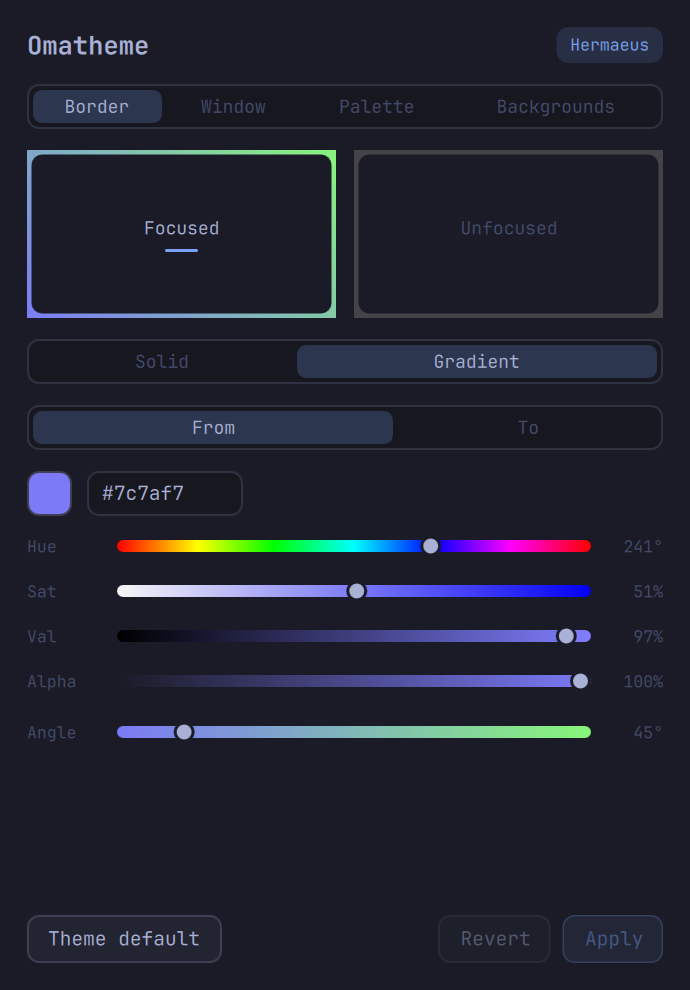
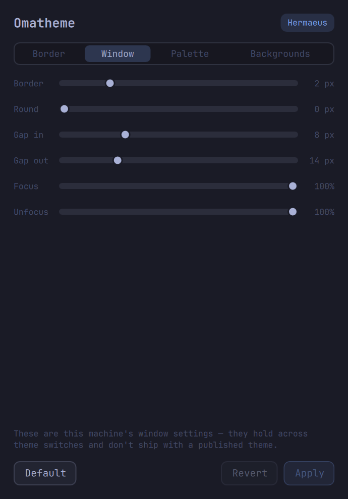
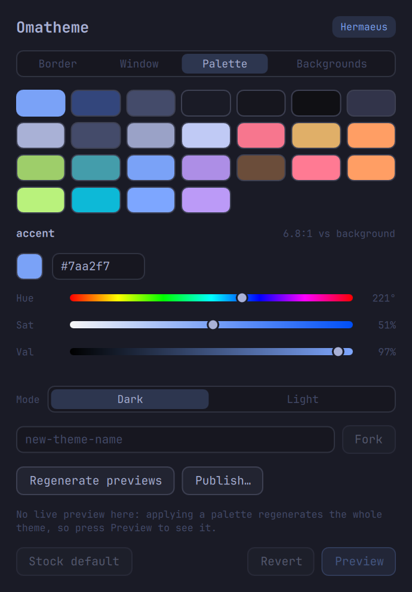
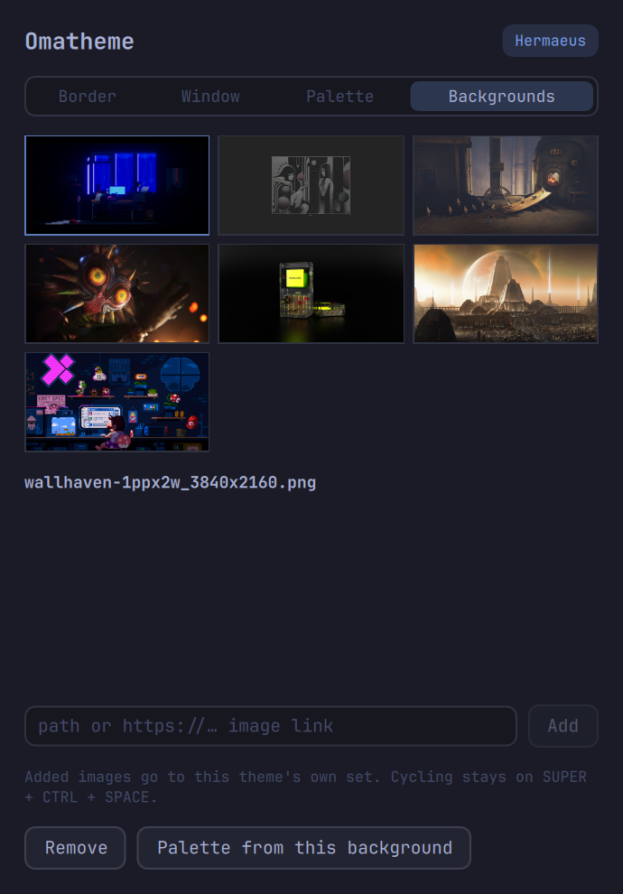

# Omatheme

A [Quickshell](https://quickshell.org) app for designing an
[Omarchy](https://omarchy.org) Quattro theme in place — live on the desktop
it is theming, painted from the very palette it edits.

It is built as a shell plus panels, switched by tabs that keep each panel's
unsaved edits alive:

- **Border** — the window border colors. Quattro derives every border from
  the active theme's `colors.toml` (`hyprland_active_border` /
  `hyprland_inactive_border`), and the same key feeds the bar, notifications
  and the lock screen, so a change lands everywhere at once. Dragging pushes
  the border straight into the running compositor with `hyprctl eval`
  (Quattro's Lua parser rejects `hyprctl keyword`); nothing is written until
  **Apply**.
- **Window** — the chrome Hyprland owns rather than the theme: border width,
  corner rounding, gaps and opacity. Live preview via the same eval path;
  Apply persists to `~/.config/hypr/looknfeel.lua`, touching only the six
  keys it owns and leaving the rest of that file byte-identical.
- **Palette** — a swatch grid over the theme's color keys, with a live WCAG
  contrast readout for the selected key. Applying a palette regenerates the
  whole theme (`omarchy theme set`, too slow for live-on-drag), so edits
  collect behind an explicit **Preview** — which also re-skins the app
  itself, since it paints from the theme it edits. This panel also carries
  the authoring actions: a Dark/Light mode switch, the fork field, preview
  regeneration and publishing.
- **Backgrounds** — a thumbnail grid over the theme's background set: click
  to apply, add from a local path or an image URL, remove. Curating what a
  theme *ships* lives here; cycling between backgrounds stays with Omarchy
  (`SUPER + CTRL + SPACE`). "Palette from this background" generates a
  candidate palette from the selected wallpaper and stages it in the
  Palette panel as pending edits — nothing touches disk until you judge the
  swatches and press Preview.

|                                   |                                   |
| :-------------------------------: | :-------------------------------: |
|   |   |
|  |  |

Editing a stock theme never touches `/usr/share/omarchy`: writes land in a
user overlay under `~/.config/omarchy/themes/<slug>/`, which is Omarchy's
documented override mechanism. The window scales with
`omarchy display text size`, and panel content scrolls when a short screen
or a big text scale leaves it no room.

## Authoring a theme

The tool's second job is making a theme that can leave your machine:

1. **Fork** a starting point in the Palette panel — a stock theme, or the
   one you're running.
2. **Backgrounds**: add the wallpapers the theme should ship (they go into
   the fork's own `backgrounds/`, so publishing carries them).
3. **Palette**: generate from a wallpaper, or edit by hand with the
   contrast hints; flip mode if you crossed the dark/light line.
4. **Regenerate previews** so the theme switcher shows your fork's real
   face instead of its parent's (the capture briefly dodges the app's own
   window off-screen).
5. **Publish** — the theme directory becomes a git repo with copy-pasteable
   next steps; anyone installs it with `omarchy theme install <url>`.

One inherited edge: forks copy their parent's `neovim.lua` / `vscode.json`
/ `icons.theme`, so a heavily recolored fork should have those edited by
hand — they are editor configs, not palette entries.

## Shell-first architecture

QML draws, shell scripts mutate. Every panel has an `omatheme-<domain>`
helper with `show` / `set` / `reset` subcommands, so anything the GUI can do
is also reachable and testable from a terminal:

```bash
omatheme-state                   # current theme, palette, font, text scale
omatheme-border show
omatheme-border set --active "rgba(33ccffee) rgba(00ff99ee) 45deg"
omatheme-window set --rounding 12 --gaps-in 4
omatheme-window reset --all
omatheme-palette set --accent "#ff9e64"
omatheme-palette mode light
omatheme-palette generate wallpaper.png --apply
omatheme-palette fork my-new-theme
omatheme-bg add https://example.com/wallpaper.jpg
omatheme-bg set wallpaper.jpg
omatheme-preview regen
omatheme-publish --push git@github.com:you/omarchy-my-new-theme-theme.git
```

## Install

Omatheme is an [Omarchy shell plugin](https://learn.omacom.io/2/the-omarchy-manual/32-shell-plugins)
— it runs as a panel inside the `omarchy-shell` process, so it needs
Omarchy 4.0+ plus ImageMagick and `inotify-tools`:

```bash
omarchy plugin add https://github.com/Davies-Sam/omatheme.git --enable
```

Then summon it:

```bash
omarchy-shell shell toggle davies-sam.omatheme '{}'
```

or bind that — in Quattro's `~/.config/hypr/bindings.lua`:

```lua
hl.bind({ "SUPER", "SHIFT", "CTRL" }, "T", "exec",
  "omarchy-shell shell toggle davies-sam.omatheme '{}'")
```

and float it in `~/.config/hypr/hyprland.lua`:

```lua
hl.window_rule({ float = true, match = { title = "^Omatheme$" } })
```

(Quickshell hardcodes the app-id `org.quickshell` for every surface, so
rules must match on the title.)

Optional extras, for a launcher entry and terminal-friendly helpers —
from the installed plugin directory:

```bash
PLUGIN=~/.config/omarchy/plugins/davies-sam.omatheme
ln -s "$PLUGIN/bin/omatheme" ~/.local/bin/omatheme
ln -s "$PLUGIN/share/applications/omatheme.desktop" ~/.local/share/applications/
mkdir -p ~/.local/share/icons/hicolor/scalable/apps ~/.local/share/icons/hicolor/256x256/apps
ln -s "$PLUGIN/share/icons/hicolor/scalable/apps/omatheme.svg" ~/.local/share/icons/hicolor/scalable/apps/
ln -s "$PLUGIN/share/icons/hicolor/256x256/apps/omatheme.png" ~/.local/share/icons/hicolor/256x256/apps/
```

## Developing

Work in a clone, deploy by copy (the plugin folder may not contain
symlinks, and the shell only hot-reloads real file changes — a restart
picks up changes reliably):

```bash
rsync -a --delete --exclude .git ./ ~/.config/omarchy/plugins/davies-sam.omatheme/
omarchy-restart-shell
omarchy-shell shell summon davies-sam.omatheme '{}'
```

`tests/run` exercises every bundled helper end to end on a throwaway
fork and restores the desktop it started on.

## Adding a panel

1. Write `Panels/<Name>Panel.qml` — a ColumnLayout owning its own state,
   processes and action buttons, like `Panels/BorderPanel.qml`.
2. Add a small `omatheme-<domain>` helper next to the others for the reads
   and writes it needs (`omatheme-lib` has the shared theme plumbing).
3. Add one entry to `panels` in `Omatheme.qml`. The switcher appears
   automatically at two panels.

Development notes and the original build plan live in
[omatheme-goal.md](omatheme-goal.md).
